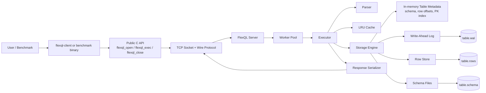

# FlexQL Design

## Architecture

## Components

- `src/flexql.cpp`
  Implements the public client API and the binary request/response protocol over TCP.

- `src/server.cpp`
  Accepts connections, dispatches requests through the worker pool, and serializes responses back to clients.

- `src/parser.cpp`
  Parses the supported SQL subset: `CREATE TABLE`, `INSERT`, `SELECT`, single-condition `WHERE`, and `INNER JOIN`.

- `src/executor.cpp`
  Validates schema-constrained inserts, executes queries, applies expiry filtering, uses the PK fast path when possible, and consults the LRU cache for small repeated selects.

- `src/storage.cpp`
  Manages persistent table files, WAL-backed recovery, row scanning, row lookup by offset, and in-memory metadata rebuild on startup.

- `src/lru_cache.cpp`
  Stores small `SELECT` result sets to speed up repeated read queries without caching huge scans.

## Data Flow

1. A client sends SQL through `flexql_exec`.
2. The server reads the request and hands it to a worker.
3. The executor parses the SQL and chooses the execution path.
4. Inserts are validated against schema rules, appended through WAL/storage, and indexed by primary key.
5. Selects either use the PK index, scan rows sequentially, or execute an `INNER JOIN`.
6. Results are serialized and sent back over the same TCP connection.

## Storage Model

- Source of truth is disk-backed table storage under `flexql_data/`.
- Each table uses:
  - `<table>.schema`
  - `<table>.rows`
  - `<table>.wal`
- Startup recovery reloads schema metadata and replays remaining WAL contents.

## Concurrency Model

- Multiple clients connect concurrently over TCP.
- The server processes requests through a worker pool.
- Table access is protected with reader/writer locking.
- Large reads are streamed so result sets do not need to be fully materialized in memory.

## Performance Notes

- Batched inserts reduce protocol and write overhead.
- Sequential buffered scans reduce syscall overhead during large `SELECT`s.
- Small repeated `SELECT`s can hit the LRU cache.
- Large result sets are intentionally streamed instead of cached.
