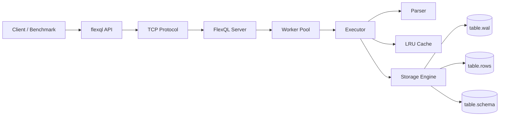

# FlexQL

FlexQL is a simplified SQL-like client/server database driver written in C++17.
It provides:

- a TCP client API in `include/flexql.h`
- a multithreaded TCP server
- persistent on-disk table storage plus WAL-backed recovery
- schema-aware inserts with expiration filtering
- primary-key indexing and query-result caching

For the system architecture diagram and design notes, see [DESIGN.md](./DESIGN.md).

## Architecture




## Supported SQL

The implementation currently supports the subset required by the assignment:

- `CREATE TABLE`
- `INSERT INTO ... VALUES ...`
- `SELECT * FROM ...`
- `SELECT col1, col2 FROM ...`
- single-condition `WHERE`
- `INNER JOIN`

Assignment-specific schema rules enforced by the current build:

- supported column types are `INT`, `DECIMAL`, `VARCHAR(n)`, and `DATETIME`
- each table schema must include an `EXPIRES_AT` column
- inserted values are validated against the declared schema
- expired rows are filtered out during query execution

## Build

From the project directory:

```bash
cd ~/Desktop/dl\ project/flexql
make all
```

To force a rebuild:

```bash
make clean
make all
```

To clear persistent table data before a fresh benchmark run:

```bash
make reset-data
```

## Run

Start the server in one terminal:

```bash
cd ~/Desktop/dl\ project/flexql
./bin/flexql-server 9000
```

Run the reference benchmark in another terminal:

```bash
cd ~/Desktop/dl\ project/flexql
./bin/benchmark_flexql --unit-test
```

For insertion throughput:

```bash
./bin/benchmark_flexql 1000000
./bin/benchmark_flexql 10000000
```

To save benchmark output to a file:

```bash
./bin/benchmark_flexql 10000000 | tee benchmark.out
```

Interactive client:

```bash
./bin/flexql-client 127.0.0.1 9000
```

## Persistent Storage

FlexQL stores data under `flexql_data/` in the server working directory.
For each table it maintains:

- `<table>.schema`
- `<table>.rows`
- `<table>.wal`

The WAL is replayed on startup before queries are served.

## Large-Dataset Results

Measured locally on this codebase.

Reference benchmark `benchmark_flexql.cpp`:

- unit tests: `21/21 passed`
- `1,000,000` rows: `1073 ms`, `931,966 rows/sec`
- `10,000,000` rows: `11832 ms`, `845,165 rows/sec`

These numbers depend on hardware, kernel, storage performance, and the benchmark's configured insert batch size.
